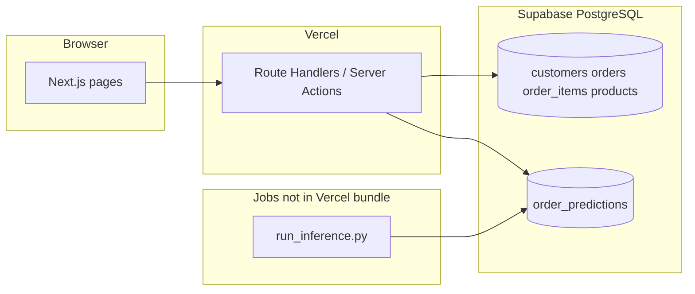

# Frontend & Web App Implementation Plan (Vercel)

This document is the implementation plan for **Part 1: Deploy a Web App with Vercel**, aligned with Chapter 17 (Sections 17.1–17.9: philosophy, architecture, jobs layout, config, DB utils, ETL, training, inference, scheduling, and app integration) and the decisions already captured in `PLAN.md`, `chapter_seventeen_implementation.md`, and `COMPUTING_CONSTRAINTS.md`.

**Pedagogical source of truth:** the operational schema and workflows are defined around **`shop.db`** (SQLite) in the textbook-style guide. **Deployed hosting on Vercel** cannot reliably use a bundled SQLite file as a shared writable operational store across serverless invocations, so this plan follows **`PLAN.md`**: migrate operational data to **Supabase (PostgreSQL)**, keep the same table names and query semantics, and treat `shop.db` as the local seed/export format.

---

## 1. Goals (assignment checklist)

The deployed app must include:

| Requirement | Implementation target |
|-------------|-------------------------|
| **Select Customer** (no signup/login) | Dedicated route lists customers; choosing one stores `customer_id` (cookie or equivalent) and navigates to the dashboard. |
| **Customer dashboard** | Summary metrics (e.g. order count, total spend) and recent orders for the selected customer. |
| **Place new order** | Form flow that inserts into `orders` and `order_items` in one transaction and persists to the operational DB. |
| **Order history** | List of orders for the selected customer; optional detail route for line items. |
| **Late Delivery Priority Queue** | Warehouse view: **top 50** unfulfilled orders by **`late_delivery_probability` DESC** (then tie-break e.g. `order_timestamp ASC`), using the Chapter 17 join pattern. |
| **Run Scoring** | Control that triggers the **ML inference job** (same behavior as `jobs/run_inference.py`), then **refreshes** the priority queue data. |

**Chapter 17 rule:** the web app **never** imports sklearn, joblib, or other ML libraries. It only reads **`order_predictions`** (and related operational tables) like normal data.

---

## 2. Stack and constraints (from `PLAN.md` + `COMPUTING_CONSTRAINTS.md`)

| Layer | Choice | Notes |
|-------|--------|--------|
| Framework | **Next.js (App Router)** | Matches `PLAN.md` Phase 5 and `chapter_seventeen_implementation.md` “Vibe-Code App Spec”. |
| Hosting | **Vercel** | Connect repo; set env vars per environment. |
| Operational DB (prod) | **Supabase (PostgreSQL)** | Anon key for browser-safe reads/writes allowed by RLS policies. |
| DB client | `@supabase/supabase-js` | Use `NEXT_PUBLIC_SUPABASE_URL` and `NEXT_PUBLIC_SUPABASE_ANON_KEY` on Vercel. |
| ML jobs | Python jobs in `jobs/` | Run locally and/or via **cron** on your Mac per Chapter 17; **not** inside the Next.js bundle. |

**Computing constraints (M2, 8 GB RAM):** training/tuning should follow `COMPUTING_CONSTRAINTS.md` (e.g. `n_jobs=-1` where applicable, avoid huge grids). That mainly affects **local** job runs, not the Vercel UI.

**Vercel-specific note:** the default Node.js serverless runtime **does not** run your checked-in `python jobs/run_inference.py` unless you add a separate execution path (see §6). The UI plan must separate **“trigger inference”** from **“display predictions”**.

---

## 3. Architecture (Chapter 17 embedded pattern)



- **Reads:** dashboard, order history, priority queue query `order_predictions` joined to `orders` / `customers`.
- **Writes:** new orders go to `orders` + `order_items` only.
- **Inference:** updates `order_predictions` for `fulfilled = 0` orders; identical feature logic to training/ETL (see `chapter_seventeen_implementation.md`).

---

## 4. Information architecture & routes

Base the route map on `chapter_seventeen_implementation.md` and `PLAN.md` Phase 5:

| Route | Purpose |
|-------|---------|
| `/` | Redirect to `/select-customer` or `/dashboard` if cookie present. |
| `/select-customer` | Load customers from DB; on select, set `customer_id` cookie, redirect to `/dashboard`. |
| `/dashboard` | Order summaries + recent orders for selected customer. |
| `/place-order` | Create order + line items (transaction). |
| `/orders` | Order history for selected customer. |
| `/orders/[order_id]` | Optional: line items for one order. |
| `/warehouse/priority` | **Late Delivery Priority Queue** — table built from the SQL below, **LIMIT 50**. |
| `/scoring` (or embed on warehouse page) | **Run Scoring** UX + status; after success, navigate or revalidate `/warehouse/priority`. |

**Priority queue SQL** (PostgreSQL string concat; adjust if you use `concat_ws`):

```sql
SELECT
  o.order_id,
  o.order_timestamp,
  o.total_value,
  o.fulfilled,
  c.customer_id,
  c.first_name || ' ' || c.last_name AS customer_name,
  p.late_delivery_probability,
  p.predicted_late_delivery,
  p.prediction_timestamp
FROM orders o
JOIN customers c ON c.customer_id = o.customer_id
JOIN order_predictions p ON p.order_id = o.order_id
WHERE o.fulfilled = 0
ORDER BY
  p.late_delivery_probability DESC,
  o.order_timestamp ASC
LIMIT 50;
```

---

## 5. Session model (no auth)

- **Mechanism:** HTTP-only or secure cookie storing `customer_id` (or a short-lived signed token if you want tamper resistance).
- **Guards:** If no customer is selected, redirect protected routes (`/dashboard`, `/place-order`, `/orders`, …) to `/select-customer`.
- **No passwords:** do not implement signup/login for this assignment scope.

---

## 6. “Run Scoring” — design options (must match Chapter 17 behavior)

Chapter 17 describes a button that **runs inference** (equivalent to `run_inference.py`) and then **refreshes** the queue. On Vercel, pick **one** of these patterns:

| Option | How it works | Pros / cons |
|--------|----------------|-------------|
| **A. Secure API + external worker** | Next.js Route Handler calls **HTTPS** on a small service (e.g. Railway/Render/Fly) or **Supabase Edge Function** that runs Python or invokes your script. | Strong match to “button triggers job”; requires hosting the worker and secrets. |
| **B. GitHub Actions `workflow_dispatch`** | Button hits a Route Handler that uses a **GitHub token** to dispatch a workflow that runs `run_inference.py` on a runner with secrets. | No extra app server; depends on GitHub + queue latency. |
| **C. Cron-only inference + refresh button** | Cron (per Chapter 17) runs inference every 5 minutes; the button only **revalidates** data (`router.refresh()` / `revalidatePath`) and optionally shows **last `prediction_timestamp`**. | Easiest on Vercel; button does **not** truly “run” inference unless you rename the requirement to “refresh after scheduled scoring”. **Verify this meets the rubric.** |

**Recommendation for the course deliverable:** implement **(A)** or **(B)** if the grader expects a genuine trigger; otherwise document the choice in the README and implement **(C)** only with explicit team/instructor agreement.

**Never:** run sklearn inference inside the Next.js Node process unless you have a dedicated, supported Python runtime path—keep separation of concerns as in Chapter 17.

---

## 7. Implementation phases

### Phase F0 — Repository & env

- [ ] Add Next.js app (App Router) in repo root or `web/` (team choice); align imports and Vercel “Root Directory”.
- [ ] Copy env pattern from `PLAN.md`: `.env.example` (public var names only), `.env.local` for local secrets (gitignored).
- [ ] Vercel project: set `NEXT_PUBLIC_SUPABASE_URL`, `NEXT_PUBLIC_SUPABASE_ANON_KEY`.

### Phase F1 — Supabase data contract

- [ ] Operational tables present: `customers`, `orders`, `order_items`, `products` (migrated from `shop.db` per `PLAN.md` Phase 0).
- [ ] After jobs run: `order_predictions` populated for unfulfilled orders (`WHERE fulfilled = 0` in inference).
- [ ] **RLS / policies:** allow anon reads (and inserts for orders) as required by the app; never expose service-role keys to the browser.

### Phase F2 — Customer selection & dashboard

- [ ] `/select-customer`: server component or client fetch from Supabase; searchable list if row count is large.
- [ ] `/dashboard`: aggregate queries (counts, sum of `total_value` or line totals—match your schema), plus “recent N orders”.

### Phase F3 — Orders

- [ ] `/place-order`: product picker, quantities, server action or Route Handler wrapping a **transaction** (insert order, then items).
- [ ] `/orders` and optional `/orders/[order_id]`: filtered by `customer_id` from cookie.

### Phase F4 — Warehouse priority queue

- [ ] `/warehouse/priority`: server-side fetch using the SQL in §4; show probability, timestamps, customer name, order metadata; empty state if no unfulfilled scored orders.

### Phase F5 — Run Scoring + refresh

- [ ] Implement chosen option from §6; on success, refresh priority data (revalidate or client refresh).
- [ ] Surface errors (inference failed, worker timeout) in the UI.

### Phase F6 — Deploy & verify

- [ ] `npm run build` passes locally.
- [ ] Push to `main`; Vercel build green.
- [ ] Manual test script: select customer → dashboard → place order → see history → open priority queue → run scoring path → confirm updated rows/timestamps.

---

## 8. Testing checklist (maps to `PLAN.md` Phase 5 tests)

- [ ] Local: `npm run dev` loads app.
- [ ] `/select-customer` shows real rows; selection sets cookie and reaches `/dashboard`.
- [ ] Dashboard numbers match Supabase (not hardcoded).
- [ ] New order appears in `orders` / `order_items` in Supabase.
- [ ] `/warehouse/priority` shows up to 50 rows, sorted by late probability descending.
- [ ] Production URL works with Vercel env vars.
- [ ] After inference runs (however triggered), refreshed page shows updated `prediction_timestamp` where applicable.

---

## 9. Files to add (suggested)

| Area | Suggested files |
|------|-----------------|
| Supabase client | `lib/supabase/client.ts`, `lib/supabase/server.ts` (cookie-aware if using server components). |
| Session | `lib/session.ts` (get/set `customer_id`). |
| Queries | `lib/queries/*.ts` or colocated server loaders. |
| API / actions | `app/api/.../route.ts` or `app/.../actions.ts` for orders and scoring trigger. |
| UI | `app/(shop)/.../page.tsx` per route; shared layout and navigation. |

---

## 10. Alignment summary

| Chapter 17 idea | Where it shows up |
|-----------------|-------------------|
| App reads predictions table only | Priority queue + any score displays. |
| Inference writes `order_predictions` | Python `jobs/run_inference.py` (and optional worker in §6). |
| `LIMIT 50` priority queue | `/warehouse/priority`. |
| No ML in the app bundle | Next.js uses Supabase SQL only. |
| Scheduling (§ cron) | Local `crontab` per `PLAN.md` / textbook; complements Run Scoring. |

This plan is the single place to track **frontend + Vercel** work; keep **ETL / train / inference** details in `PLAN.md` and `chapter_seventeen_implementation.md` synchronized when schema or job commands change.
